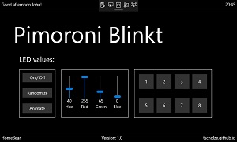
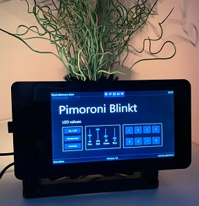

# HomeBear.Blinkt

 

> Windows 10 IoT Core UWP app that works great with the Pimoroni Blinkt! LED Raspberry Pi HAT. The app is in a final state. No maintenance effort planned.

## Prerequirements
- Windows 10
- Visual Studio 2019
- Raspbbery Pi 3 (B) with [Windows 10 IoT Core](https://developer.microsoft.com/en-us/windows/iot) 17763 or higher
- [Pimoroni Blinkt!](https://shop.pimoroni.com/products/blinkt) Raspberry Pi HAT

## How it looks

## Contributing

Feel free to improve the quality of the code. It would be great to learn more from experienced C#, UWP and IoT developers.

## Authors

Just me, [Tobi]([https://tscholze.github.io).

## Special thanks to
Thanks to [cpayette](https://www.twitch.tv/cpayette) to encouraging me to stay on the ball with Windows 10 IoT Core and keep streaming my coding attemps.

## Thanks to

* [MarcJenningsUK](https://github.com/MarcJenningsUK/PimoroniSharp) - PimoroniSharp
* [Google Material Design](https://materialdesignicons.com/) - Blinkt Icon

## License

This project is licensed under the MIT License - see the [LICENSE](LICENSE.md) file for details.
Dependencies or assets maybe licensed differently.
